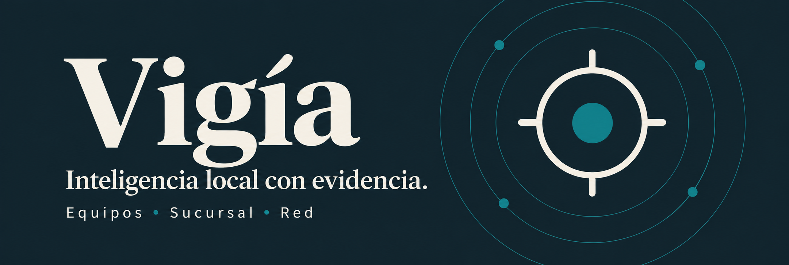
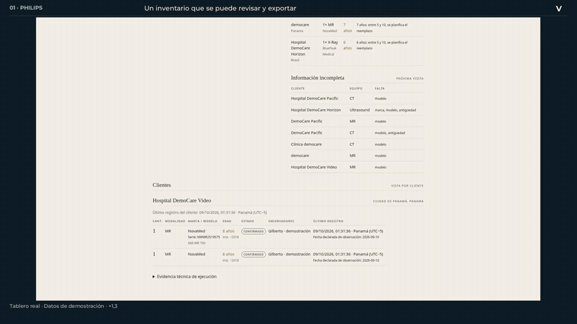
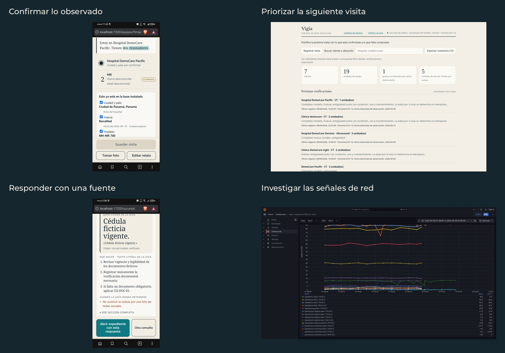

<p align="center">
  
</p>

Vigía convierte **voz, fotos y observaciones de campo en información revisable**. Usa QVAC para inferir en equipos propios o delegar a pares autorizados; cada resultado indica dónde se ejecutó y qué evidencia lo respalda.

**[Ver demostración](https://vigia.ciberpty.com/#demo) · [Abrir Vigía](https://vigia.ciberpty.com/inicio) · [Instalación](docs/EJECUCION.md)**

<details>
<summary><strong>Ver Vigía en movimiento · 18 segundos</strong></summary>



Selección de pantallas reales; esperas abreviadas. Todos los datos de demostración son sintéticos.

</details>

## Tres espacios, un mismo motor

| Espacio | Qué resuelve | Track |
|---|---|---|
| **Equipos** | Dictar una visita, fotografiar una placa, confirmar campos y consolidar el inventario. | Philips |
| **Sucursal** | Consultar una guía con fuentes, documentar la atención y verificar el acta sin servidor. | Caja de Ahorros |
| **Red** | Detectar señales DNS, pedir a QVAC una explicación y revisar alertas en Wazuh y métricas en Grafana. | Ovnicom |

El **Desafío General · Sovereign Intelligence at the Edge** reúne la inferencia local, la delegación por llave pública y la evidencia verificable. No presentamos el track QVAC Psy; VisionPsy se utiliza como lector de placas en Equipos.



Ampliar: [Equipos](docs/media/equipos.png) · [Tablero](docs/media/tablero.png) · [Sucursal](docs/media/sucursal.png) · [Red](docs/media/red.png)

## Qué hace QVAC

**Qwen3** extrae y responde; **Whisper** transcribe; **VisionPsy** lee placas; **Supertonic 2** lee las respuestas. El SDK `@qvac/sdk` está fijado en **0.18.2** para conservar la delegación P2P mediante Hyperswarm. Los nodos se encuentran por llave pública; el enlace HTTPS del navegador es otra capa.

La persona confirma el inventario y revisa las fuentes. En Red, las reglas detectan y el modelo propone una explicación; **no hay bloqueos automáticos**. Las actas usan SHA-256 y Ed25519: prueban integridad y firma de una llave, no la identidad de su propietario.

### También en modo avión

El prototipo **Sucursal local** sirve su web desde Termux y ejecuta Qwen3-0.6B mediante QVAC Bare en la CPU del HONOR. Una consulta breve funcionó con Wi-Fi y datos apagados y sin puente al servidor: **6.7 s de carga + 19.3 s de inferencia**. [Resultado y controles](evidencia/sucursal-webapp-avion-10sep.md).

Ya abre desde su icono como **Vigía local** en el HONOR. [Instalar la interfaz](docs/INSTALACION-CLIENTES.md) · [Apertura y nueva consulta en modo avión](evidencia/pwa-v5/README.md). Es una extensión de texto con modelos previamente instalados. **Instalar la PWA no instala QVAC ni los modelos.** No es una APK autónoma y todavía necesita el nodo Termux activo; no incluye voz, foto ni expedientes completos. En la app principal, sin acceso al nodo, se conservan capturas pendientes.

## Empezar

Node **22+**; `ffmpeg` para el dictado. La primera ejecución descarga los modelos.

```bash
npm ci
npm test
VISION=1 npm start
```

Abre **http://localhost:7320**. Para elegir GPU, activar voz en GPU, desplegar el nodo o conectar un par: [guía de ejecución](docs/EJECUCION.md). Para el prototipo Android: [requisitos y paquete Termux](docs/SUCURSAL-LOCAL-TERMUX.md).

## Para evaluar

[Acceso del jurado](docs/EVALUACION-EN-LINEA.md) · [Guía por track](docs/GUIA-EVALUACION.md) · [Qué diferencia a Sucursal de lo existente](docs/DIFERENCIACION-CAJA.md).

## Evidencia y alcance

- [Mediciones con denominadores y hardware](docs/MEDICIONES.md), [modelos y componentes de terceros](THIRD_PARTY.md).
- [Funcionamiento y límites](docs/PRODUCTO-Y-LIMITES.md): datos ficticios, revisión humana y comportamiento sin conexión.
- Ovnicom usa un **replay finito** de registros sintéticos; latencia y rcode son simulados. No acredita monitoreo continuo de una red de producción.
- Sucursal local puede equivocarse o abstenerse aunque la guía contenga el dato. No autoriza operaciones bancarias.

**Base preexistente declarada:** una librería propia de experimentación con QVAC sirvió como referencia de diseño y mediciones; su código no se incorporó al producto entregado. [Procedencia por componente](evidencia/procedencia.md), conforme al artículo 11.c.

Equipo **ciberpty** · Decentralized AI Hackathon 2026 · Panamá · [MIT](LICENSE)
